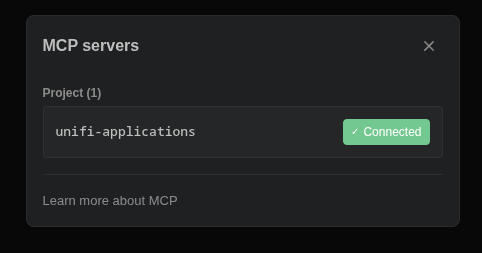
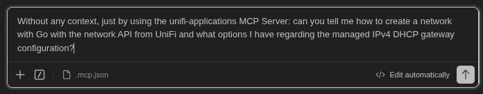
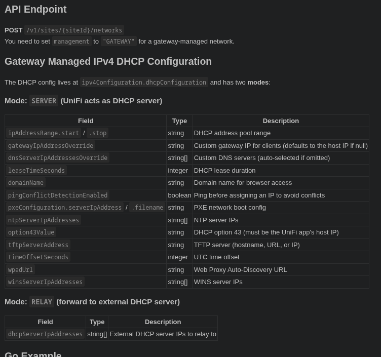
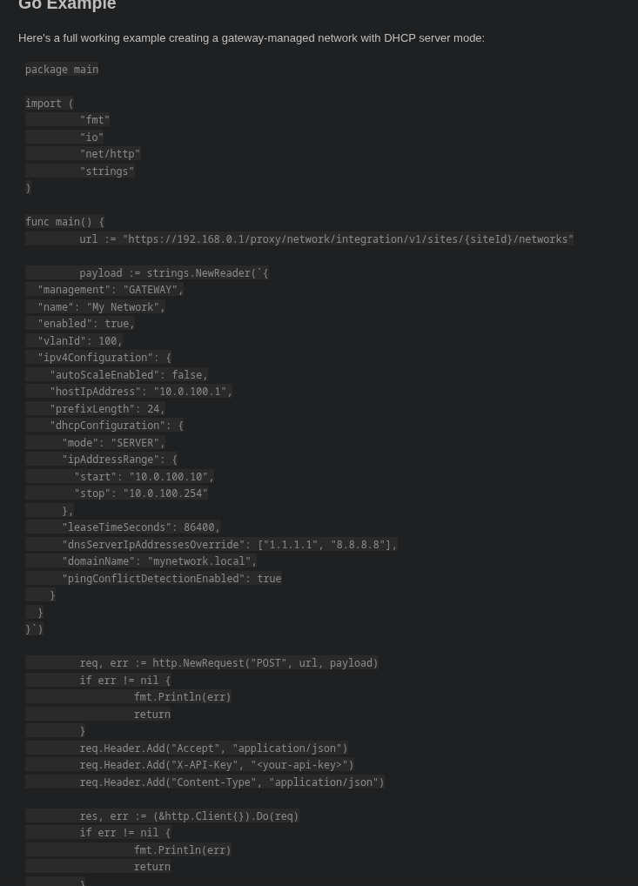
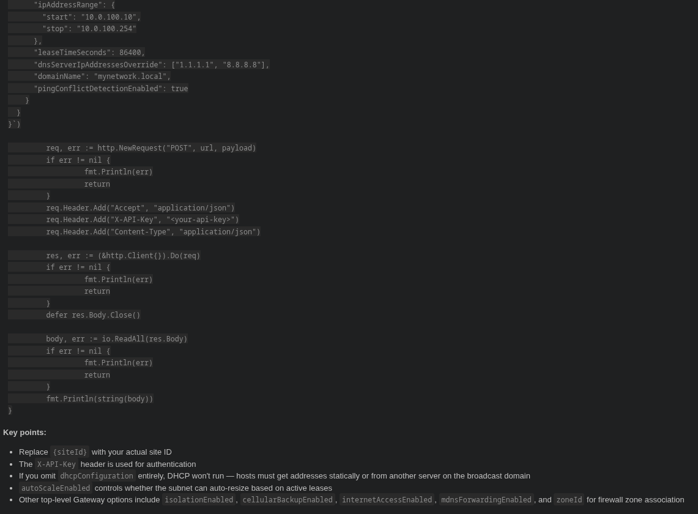

# MCP UniFi Applications

An MCP server that exposes [UniFi application API](https://developer.ui.com) documentation (Network, Protect, Site Manager) as queryable tools for Claude Desktop, Claude Code (VS Code / JetBrains), or any MCP-compatible client.

Includes a Playwright-based scraper that turns the JS-rendered docs SPA into structured JSON files, and a Python MCP server that serves them.

## Example

> *"Can you tell me how to create a network with Go with the network API from UniFi and what options I have regarding the managed IPv4 DHCP gateway configuration?"*

<p align="center">
  
  <br><br>
  
</p>

Claude automatically queries the MCP server — searching endpoints, fetching schemas, and drilling into discriminator variants — then responds with the full API details and a working Go example:

<p align="center">
  
  <br>
  
  
</p>

## Quick Start

### 1. Scrape the docs

The scraper runs inside Docker (requires Playwright/Chromium):

```bash
# Build the scraper image
docker build -t unifi-scraper .

# Scrape Network API docs (default, latest version)
docker run --rm -v $(pwd)/docs:/output unifi-scraper node scrape.mjs

# Scrape Protect API docs
docker run --rm -v $(pwd)/docs:/output unifi-scraper node scrape.mjs --app protect

# Scrape Site Manager API docs
docker run --rm -v $(pwd)/docs:/output unifi-scraper node scrape.mjs --app site-manager

# Scrape a specific API version
docker run --rm -v $(pwd)/docs:/output unifi-scraper node scrape.mjs --app network --version v9.5.21

# List available API versions for an app
docker run --rm unifi-scraper node scrape.mjs --app protect --list-versions

# Scrape specific pages only
docker run --rm -v $(pwd)/docs:/output unifi-scraper node scrape.mjs createnetwork filtering

# Force re-scrape (overwrite existing files)
docker run --rm -v $(pwd)/docs:/output unifi-scraper node scrape.mjs --force
```

Pre-scraped docs for Network API v10.1.84 are included in `docs/network/`.

### 2. Install the MCP server

```bash
python -m venv .venv
source .venv/bin/activate  # or: source .venv/bin/activate.fish
pip install .
```

### 3. Register with your client

**Claude Code (VS Code / JetBrains)** - add `.mcp.json` to your project root (Reload Window after):

```json
{
  "mcpServers": {
    "unifi-docs": {
      "type": "stdio",
      "command": "/path/to/mcp-unifi-applications/.venv/bin/python",
      "args": ["/path/to/mcp-unifi-applications/mcp_server.py"]
    }
  }
}
```

**Claude Desktop** - add to `~/.config/Claude/claude_desktop_config.json` (Linux) or `~/Library/Application Support/Claude/claude_desktop_config.json` (macOS):

```json
{
  "mcpServers": {
    "unifi-docs": {
      "command": "/path/to/mcp-unifi-applications/.venv/bin/python",
      "args": ["/path/to/mcp-unifi-applications/mcp_server.py"]
    }
  }
}
```

## Supported Applications

| Application | URL | Local/Remote | Notes |
|---|---|---|---|
| Network | `developer.ui.com/network` | Both | Default app |
| Protect | `developer.ui.com/protect` | Both | |
| Site Manager | `developer.ui.com/site-manager` | Remote only | No local/remote switch |

All three applications share the same docs SPA structure with version dropdowns, endpoint pages, and guide pages.

## Available Tools

| Tool | Description |
|---|---|
| `list_endpoints` | List all API endpoints, optionally filtered by HTTP method or app |
| `search_endpoints` | Fuzzy search by name, path, method, or description (filterable by app) |
| `get_endpoint` | Full schema for an endpoint (summary or raw JSON) |
| `get_endpoint_group` | All CRUD operations for a resource (e.g. "networks") |
| `get_example` | Code examples in curl, Go, Node.js, Python, or Ansible (local/remote) |
| `get_response_sample` | Example JSON response for an endpoint |
| `find_field` | Search for a field name across all endpoint schemas |
| `get_field_schema` | Drill into a specific field's subtree (e.g. `management[GATEWAY].dhcpV4`) |
| `get_guide` | API guide pages (filtering syntax, error handling, getting started) |

Tools that return multiple results accept an optional `app` parameter (`network`, `protect`, `site-manager`) to filter by application.

## Environment Variables

| Variable | Default | Description |
|---|---|---|
| `DOCS_DIR` | `./docs` (relative to `mcp_server.py`) | Directory containing scraped JSON docs. Expects app subdirectories (`network/`, `protect/`, `site-manager/`). |

## Scraper CLI

```
node scrape.mjs [options] [slug...]

Options:
  --app <name>      Application: network (default), protect, site-manager.
  --version <ver>   API version to scrape (e.g. v10.1.84). Default: latest.
  --list-versions   Print available versions and exit.
  --force           Re-scrape even if output file exists.

Arguments:
  [slug...]         Scrape only these pages. Omit to scrape all pages.
```

The slug is the last path segment of the docs URL:
`https://developer.ui.com/network/v10.1.84/createnetwork` -> `createnetwork`

Output is written to `<output>/<app>/` (e.g. `docs/network/`, `docs/protect/`).

The full scan is resumable - already-scraped pages are skipped. Use `--force` to re-scrape.

## Project Structure

```
mcp-unifi-applications/
├── scrape.mjs          # Playwright scraper (runs in Docker)
├── mcp_server.py       # MCP server (Python, stdio transport)
├── Dockerfile          # Scraper container image
├── pyproject.toml      # Python project config
├── docs/               # Scraped JSON output
│   ├── network/        # Network API docs
│   ├── protect/        # Protect API docs
│   └── site-manager/   # Site Manager API docs
└── tests/
    └── test_mcp_server.py
```

## Output Format

### Endpoint pages

```json
{
  "h1": "Create Network",
  "method": "POST",
  "path": "/v1/sites/{siteId}/networks",
  "description": "Create a new network on a site.",
  "pathParameters": [ "...fields" ],
  "requestBody": [ "...fields" ],
  "responses": [{ "statuses": ["201"], "fields": [ "...fields" ] }],
  "examples": {
    "local": { "curl": "...", "go": "...", "nodejs": "...", "python": "...", "ansible": "..." },
    "remote": { "curl": "...", "go": "...", "nodejs": "...", "python": "...", "ansible": "..." }
  },
  "responseSample": "{ ... }",
  "sourceUrl": "https://developer.ui.com/network/v10.1.84/createnetwork"
}
```

### Guide pages

```json
{
  "h1": "Filtering",
  "type": "guide",
  "content": "Markdown content...",
  "sourceUrl": "https://developer.ui.com/network/v10.1.84/filtering"
}
```

### Field objects (recursive)

```json
{
  "name": "management",
  "required": true,
  "type": "string",
  "description": null,
  "discriminator": [
    { "value": "UNMANAGED", "selected": true, "schema": [ "...sibling fields" ] },
    { "value": "GATEWAY", "selected": false, "schema": [ "...sibling fields" ] }
  ],
  "children": [ "...child fields for object types" ]
}
```

- `discriminator.schema` contains sibling fields visible when that option is active (not the discriminator field itself)
- Nesting is recursive - discriminators within variants are fully expanded
- `children` captures statically expanded object fields

## License

MIT
