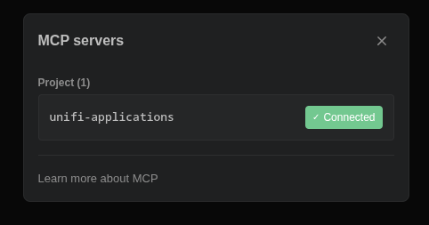
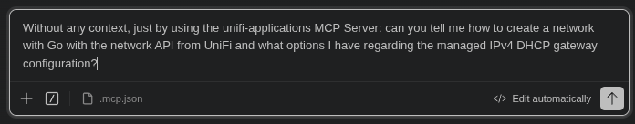
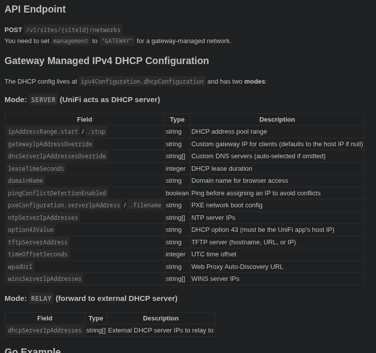
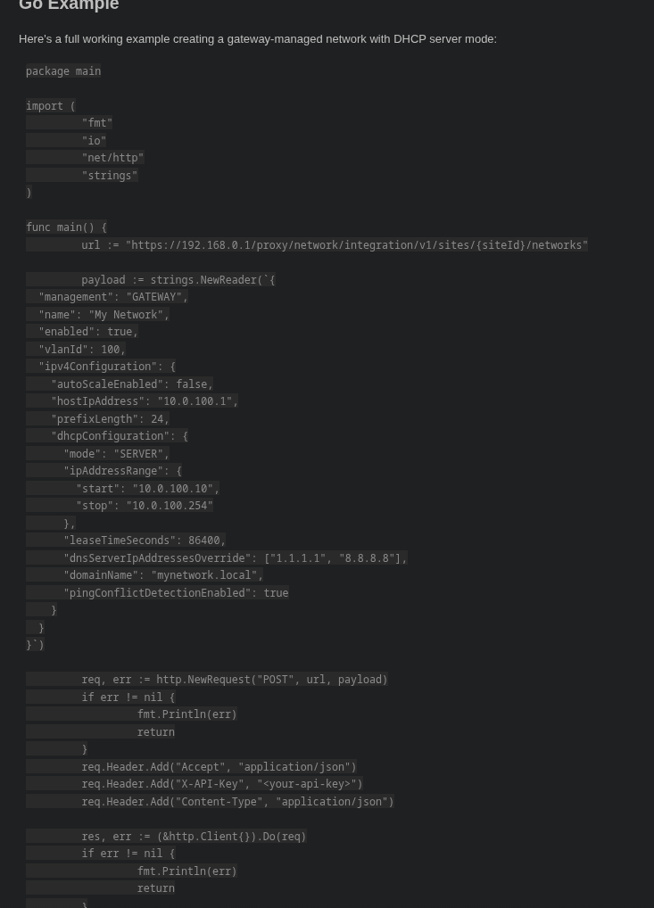
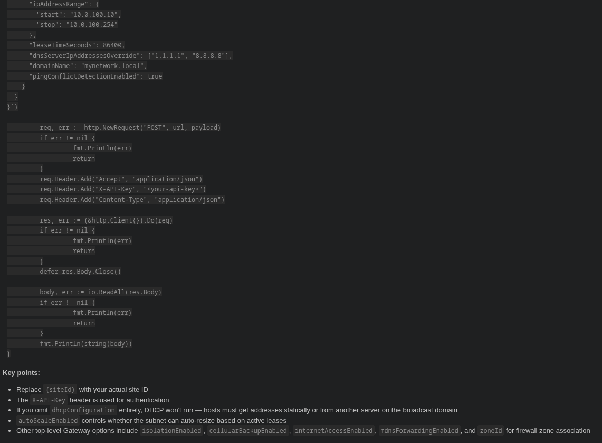

# UniFi MCP Server — Queryable API Documentation

<!-- Ownership token for the MCP registry: it fetches this README as the PyPI
     long_description and looks for this exact token. Do not remove. -->
<!-- mcp-name: io.github.KallistoX/mcp-unifi-applications -->


A Model Context Protocol (MCP) server that makes the official [UniFi API documentation](https://developer.ui.com) queryable by AI agents — endpoint search, schema drill-down, and code examples in five languages, for Claude Desktop, Claude Code (VS Code / JetBrains), or any MCP-compatible client.

Covers every application Ubiquiti publishes API docs for: **Network, Protect, Site Manager, InnerSpace, Mobility and Carrier Fabric**.

It is **read-only and credential-free**: it serves documentation, it does not talk to your controller. Includes a Playwright-based scraper that turns the JS-rendered docs SPA into structured JSON, and a Python MCP server that serves it.

## Example

> *"Can you tell me how to create a network with Go with the network API from UniFi and what options I have regarding the managed IPv4 DHCP gateway configuration?"*

<p align="center">
  
  <br><br>
  
</p>

Claude automatically queries the MCP server — searching endpoints, fetching schemas, and drilling into discriminator variants — then responds with the full API details and a working Go example:

<p align="center">
  
  <br>
  
  
</p>

## Quick Start

### 1. Scrape the docs

The scraper runs inside Docker (requires Playwright/Chromium):

```bash
# Build the scraper image
docker build -t unifi-scraper .

# Scrape Network API docs (default, latest version)
docker run --rm -v "$(pwd)/src/mcp_unifi_applications/docs:/output" unifi-scraper node scrape.mjs

# Scrape Protect API docs
docker run --rm -v "$(pwd)/src/mcp_unifi_applications/docs:/output" unifi-scraper node scrape.mjs --app protect

# Scrape Site Manager API docs
docker run --rm -v "$(pwd)/src/mcp_unifi_applications/docs:/output" unifi-scraper node scrape.mjs --app site-manager

# Scrape InnerSpace API docs
docker run --rm -v "$(pwd)/src/mcp_unifi_applications/docs:/output" unifi-scraper node scrape.mjs --app innerspace

# Scrape Mobility or Carrier Fabric API docs
docker run --rm -v "$(pwd)/src/mcp_unifi_applications/docs:/output" unifi-scraper node scrape.mjs --app mobility
docker run --rm -v "$(pwd)/src/mcp_unifi_applications/docs:/output" unifi-scraper node scrape.mjs --app carrier-fabric

# Scrape a specific API version
docker run --rm -v "$(pwd)/src/mcp_unifi_applications/docs:/output" unifi-scraper node scrape.mjs --app network --version v9.5.21

# List available API versions for an app
docker run --rm unifi-scraper node scrape.mjs --app protect --list-versions

# Scrape specific pages only
docker run --rm -v "$(pwd)/src/mcp_unifi_applications/docs:/output" unifi-scraper node scrape.mjs createnetwork filtering

# Force re-scrape (overwrite existing files)
docker run --rm -v "$(pwd)/src/mcp_unifi_applications/docs:/output" unifi-scraper node scrape.mjs --force
```

Pre-scraped docs are included, so the server works out of the box:

<!-- docs-versions:start -->
| Application | API version | Scraped | Pages |
|---|---|---|---|
| Network | v10.4.57 | 2026-07-27 | 82 |
| Protect | v7.3.47 | 2026-09-09 | 81 |
| Site Manager | v1.0.0 | 2026-07-17 | 12 |
| InnerSpace | v1.3.23 | 2026-09-09 | 12 |
| Mobility | v1.0.0 | 2026-09-09 | 9 |
| Carrier Fabric | v1.0.0 | 2026-09-09 | 14 |
<!-- docs-versions:end -->

Each app dir carries a `_meta.json` (API version, scrape date, page count); the `get_docs_info` tool reports the same at runtime. A weekly GitHub Action checks upstream for new versions and opens a PR with freshly scraped docs — the table above is regenerated in that PR by `scripts/update_readme_versions.py`.

### 2. Install the MCP server

```bash
python -m venv .venv
source .venv/bin/activate  # or: source .venv/bin/activate.fish
pip install .
```

This installs the server *and* the pre-scraped docs, and puts a `mcp-unifi-applications` executable in `.venv/bin/`.

### 3. Register with your client

**Claude Code (VS Code / JetBrains)** - add `.mcp.json` to your project root (Reload Window after):

```json
{
  "mcpServers": {
    "unifi-docs": {
      "type": "stdio",
      "command": "/path/to/mcp-unifi-applications/.venv/bin/mcp-unifi-applications"
    }
  }
}
```

**Claude Desktop** - add to `~/.config/Claude/claude_desktop_config.json` (Linux) or `~/Library/Application Support/Claude/claude_desktop_config.json` (macOS):

```json
{
  "mcpServers": {
    "unifi-docs": {
      "command": "/path/to/mcp-unifi-applications/.venv/bin/mcp-unifi-applications"
    }
  }
}
```

## How this differs from other UniFi MCP servers

Most UniFi MCP servers are **control planes**: they authenticate against your controller and expose tools that read and change live state — devices, clients, firewall rules. This one is a **knowledge plane**. It never sees your network.

|  | Control-plane servers | This server |
|---|---|---|
| Needs controller credentials | Yes | No |
| Touches live network state | Yes | No |
| Answers "what does this endpoint accept?" | Rarely | That is the whole job |
| Useful before you have hardware | No | Yes |

They are complements, not competitors. Pair this one with a control-plane server when you are *building* against the UniFi API: this one tells the model what the API looks like, the other one calls it.

### Why not just feed the model the OpenAPI spec?

Ubiquiti does publish one — `developer.ui.com/<app>/v<version>/openapi.json`. It is a good spec, and it is missing exactly the parts an agent needs most. For Network v10.4.57 (44 paths, 73 operations, 379 schemas):

- **0 code examples.** No `x-codeSamples` anywhere. This server carries ten per endpoint — curl, Go, Node.js, Python and Ansible, each in a local and a remote variant.
- **0 response examples.** This server ships the rendered response sample for every endpoint.
- **No guide pages.** Filtering syntax, error handling, getting started — those live only in the rendered docs.

And a 409 KB spec does not fit usefully into a context window. `get_field_schema` returns one field subtree (`management[GATEWAY].dhcpV4`) instead of a 70 KB endpoint schema, so the model pulls in what it needs and nothing else.

## Supported Applications

| Application | URL | Local/Remote | Notes |
|---|---|---|---|
| Network | `developer.ui.com/network` | Both | Default app |
| Protect | `developer.ui.com/protect` | Both | |
| Site Manager | `developer.ui.com/site-manager` | Remote only | No local/remote switch |
| InnerSpace | `developer.ui.com/innerspace` | Both | Early Access; version label reads `v1.3.23 (EA)` |
| Mobility | `developer.ui.com/mobility` | Remote only | Sidebar links out to `mobility.ui.com` |
| Carrier Fabric | `developer.ui.com/carrier-fabric` | Remote only | Subscriber API |

All applications share the same docs SPA structure with version dropdowns, endpoint pages, and guide pages, so adding one is a single entry in the `APPS` object in `scrape.mjs` — the server discovers new app directories on its own.

## Available Tools

| Tool | Description |
|---|---|
| `list_endpoints` | List all API endpoints, optionally filtered by HTTP method or app |
| `search_endpoints` | Fuzzy search by name, path, method, or description (filterable by app) |
| `get_endpoint` | Full schema for an endpoint (summary or raw JSON) |
| `get_endpoint_group` | All CRUD operations for a resource (e.g. "networks") |
| `get_example` | Code examples in curl, Go, Node.js, Python, or Ansible (local/remote) |
| `get_response_sample` | Example JSON response for an endpoint |
| `find_field` | Search for a field name across all endpoint schemas |
| `get_field_schema` | Drill into a specific field's subtree (e.g. `management[GATEWAY].dhcpV4`) |
| `get_guide` | API guide pages (filtering syntax, error handling, getting started) |
| `get_docs_info` | Which docs are loaded: API version, scrape date, endpoint/guide counts per app |

Tools that return multiple results accept an optional `app` parameter (`network`, `protect`, `site-manager`, `innerspace`, `mobility`, `carrier-fabric`) to filter by application.

## Environment Variables

| Variable | Default | Description |
|---|---|---|
| `DOCS_DIR` | the `docs/` directory inside the installed package | Directory containing scraped JSON docs. Expects one subdirectory per application (`network/`, `protect/`, …). Set it to point at a checkout's freshly scraped output. |

## Scraper CLI

```
node scrape.mjs [options] [slug...]

Options:
  --app <name>      Application: network (default), protect, site-manager, innerspace, mobility, carrier-fabric.
  --version <ver>   API version to scrape (e.g. v10.1.84). Default: latest.
  --list-versions   Print available versions and exit.
  --force           Re-scrape even if output file exists.

Arguments:
  [slug...]         Scrape only these pages. Omit to scrape all pages.
```

The slug is the last path segment of the docs URL:
`https://developer.ui.com/network/v10.1.84/createnetwork` -> `createnetwork`

Output is written to `<output>/<app>/` — mount the package's docs directory (`src/mcp_unifi_applications/docs/`) so a scrape lands where the server reads it.

The full scan is resumable - already-scraped pages are skipped. Use `--force` to re-scrape.

## Project Structure

```
mcp-unifi-applications/
├── scrape.mjs          # Playwright scraper (runs in Docker)
├── lib/
│   └── parse.mjs       # Scraper parsing logic, kept out of the browser so it is testable
├── Dockerfile          # Scraper container image
├── pyproject.toml      # Python project config
├── server.json         # MCP registry manifest
├── src/
│   └── mcp_unifi_applications/
│       ├── server.py   # MCP server (Python, stdio transport)
│       └── docs/       # Scraped JSON, shipped with the package
│           ├── network/
│           ├── protect/
│           ├── site-manager/
│           ├── innerspace/
│           ├── mobility/
│           └── carrier-fabric/
├── scripts/
│   └── update_readme_versions.py   # Regenerates the README version table
└── tests/
    ├── test_mcp_server.py    # pytest
    └── scrape-parse.test.mjs # node --test
```

## Output Format

### Endpoint pages

```json
{
  "h1": "Create Network",
  "method": "POST",
  "path": "/v1/sites/{siteId}/networks",
  "description": "Create a new network on a site.",
  "pathParameters": [ "...fields" ],
  "requestBody": [ "...fields" ],
  "responses": [{ "statuses": ["201"], "fields": [ "...fields" ] }],
  "examples": {
    "local": { "curl": "...", "go": "...", "nodejs": "...", "python": "...", "ansible": "..." },
    "remote": { "curl": "...", "go": "...", "nodejs": "...", "python": "...", "ansible": "..." }
  },
  "responseSample": "{ ... }",
  "sourceUrl": "https://developer.ui.com/network/v10.1.84/createnetwork"
}
```

### Guide pages

```json
{
  "h1": "Filtering",
  "type": "guide",
  "content": "Markdown content...",
  "sourceUrl": "https://developer.ui.com/network/v10.1.84/filtering"
}
```

### Field objects (recursive)

```json
{
  "name": "management",
  "required": true,
  "type": "string",
  "description": null,
  "discriminator": [
    { "value": "UNMANAGED", "selected": true, "schema": [ "...sibling fields" ] },
    { "value": "GATEWAY", "selected": false, "schema": [ "...sibling fields" ] }
  ],
  "children": [ "...child fields for object types" ]
}
```

- `discriminator.schema` contains sibling fields visible when that option is active (not the discriminator field itself)
- Nesting is recursive - discriminators within variants are fully expanded
- `children` captures statically expanded object fields

## Disclaimer

This project is not affiliated with, endorsed by, or sponsored by Ubiquiti Inc. The API documentation content scraped and served by this tool is the property of [Ubiquiti Inc.](https://ui.com) and is sourced from their public [developer portal](https://developer.ui.com). "UniFi" is a trademark of Ubiquiti Inc.

## License

MIT
